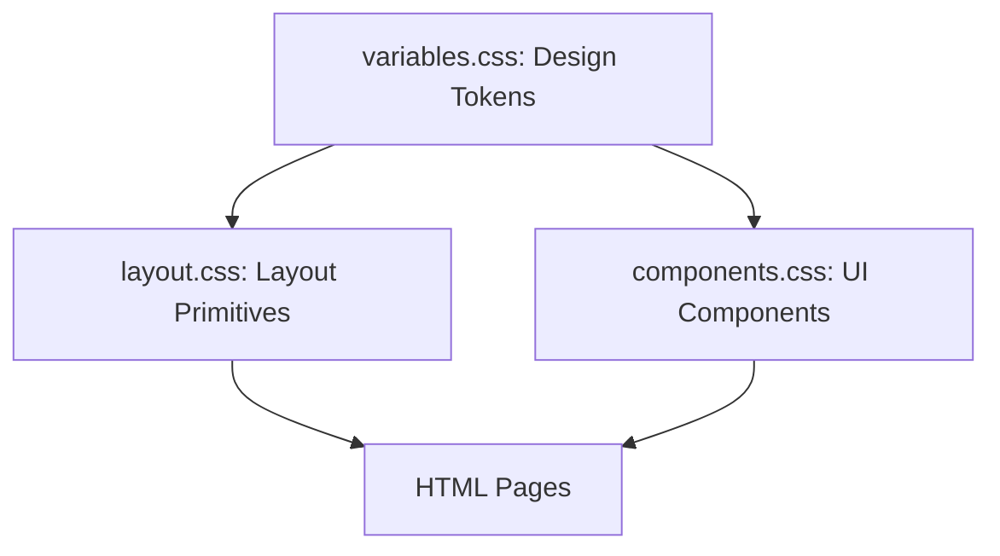

# JSR NetSol Website — Project Explanation

This document provides a comprehensive overview of the **JSR NetSol Pvt. Ltd.** website project, including its business context, codebase architecture, frontend design system, and development guidelines.

---

## 🏢 Business Context & Profile

**JSR NetSol Pvt. Ltd.** is an enterprise-grade IT infrastructure solutions partner and cybersecurity system integrator based in Nehru Place, New Delhi. The website functions as an online corporate profile designed to demonstrate technical credibility, highlight key credentials, and capture inbound consultation leads.

### 🌟 Key Corporate Credentials
* **ISO Certifications**:
  * **ISO 9001:2015** (Quality Management)
  * **ISO 14001:2015** (Environmental Management)
  * **ISO 27001:2022** (Information Security Management)
* **Standards Appraisal**: **CMMI Level 5** (Appraised at the highest level for mature processes)
* **Procurement Identifiers**:
  * **GeM Vendor** (Active seller on Government e-Marketplace)
  * **MSME Registered** (Udyam-registered for PSU preference)

### 🤝 Authorised OEM Partnerships
The project displays authorization and integrates solutions for 12 primary Original Equipment Manufacturers (OEMs):
1. **Dell Technologies**
2. **HPE**
3. **Juniper Networks**
4. **Arista Networks**
5. **Fortinet**
6. **CrowdStrike**
7. **Proxmox**
8. **Lenovo Enterprise**
9. **Palo Alto**
10. **Nutanix**
11. **CheckPoint**
12. **Sophos**

---

## 📂 Codebase & Folder Structure

The project is structured as a high-performance, clean, static multi-page website using semantic HTML5, vanilla CSS3, and modern client-side JavaScript.

```
JSR/
├── index.html                     # Home page
├── about.html                     # About Us (Company profile & history)
├── services.html                  # Core Service offerings (Consulting, MS, AMC)
├── solutions.html                 # Technical Solutions (DC, Cybersec, Networking)
├── customers.html                 # Case studies & trusted enterprise clients
├── contact.html                   # Contact page with lead capture form
├── email campaign.html            # Responsive email template for outreach
├── robots.txt                     # Crawler instructions
├── sitemap.xml                    # Sitemap for Search Engine Optimization
├── JSR_NetSol_Website_Content.md  # Raw marketing content reference
├── PROJECT_CONTEXT.md             # Background context & technical requirements
├── README.md                      # Developer entry point
├── css/
│   ├── variables.css              # Global design tokens (fonts, colors, spacing)
│   ├── layout.css                 # Layout primitives & reset styles
│   └── components.css             # Component-specific styling definitions
├── js/
│   └── main.js                    # Navigation, form submission, scroll animations
└── assets/
    ├── icons/                     # SVG & PNG UI icons
    ├── images/                    # Marketing & service imagery
    └── logos/                     # Partner & client corporate logos
```

---

## 📄 Site Architecture & Pages

The site consists of 6 primary user-facing pages, plus 1 transactional outreach template:

1. **[Home (index.html)](file:///c:/Users/Abhigyan%20Gupta/OneDrive%20-%20JSR%20NetSol%20Pvt%20Ltd/JSR/index.html)**: High-level overview of value proposition (vendor-neutral design, certified engineering, pan-India support), corporate credentials, OEM partnerships, and a summary of core capabilities.
2. **[About Us (about.html)](file:///c:/Users/Abhigyan%20Gupta/OneDrive%20-%20JSR%20NetSol%20Pvt%20Ltd/JSR/about.html)**: Deep dive into the company's timeline (established in 2016 in Nehru Place), core values, compliance certifications, and customer-first approach.
3. **[Services (services.html)](file:///c:/Users/Abhigyan%20Gupta/OneDrive%20-%20JSR%20NetSol%20Pvt%20Ltd/JSR/services.html)**: Detailed layout of JSR NetSol's 6 service pillars:
   * Consulting & Solution Design
   * Deployment & Integration
   * Managed Services (24x7 NOC/Monitoring)
   * Annual Maintenance Contracts (AMC) & Support (L1/L2/L3)
   * Technology Refresh & Migration
   * Post-deployment Training & Knowledge Transfer
4. **[Solutions (solutions.html)](file:///c:/Users/Abhigyan%20Gupta/OneDrive%20-%20JSR%20NetSol%20Pvt%20Ltd/JSR/solutions.html)**: Outlines standard architecture offerings, including Data Center Infrastructure, Enterprise Networking, Cybersecurity, Compute, Storage, Virtualization, and Wireless/SASE.
5. **[Customers (customers.html)](file:///c:/Users/Abhigyan%20Gupta/OneDrive%20-%20JSR%20NetSol%20Pvt%20Ltd/JSR/customers.html)**: Client reference listings grouped by verticals (Government/PSU, Energy/Manufacturing, BFSI, Healthcare/Pharma) showing successful engagements with organizations such as HAL, RailTel, Mankind Pharma, IFFCO Tokio, and housing.com.
6. **[Contact Us (contact.html)](file:///c:/Users/Abhigyan%20Gupta/OneDrive%20-%20JSR%20NetSol%20Pvt%20Ltd/JSR/contact.html)**: Interactive lead-capture form and corporate office detail in Nehru Place, New Delhi.
7. **[Email Campaign (email campaign.html)](file:///c:/Users/Abhigyan%20Gupta/OneDrive%20-%20JSR%20NetSol%20Pvt%20Ltd/JSR/email%20campaign.html)**: A custom-designed, table-based responsive HTML email campaign focused on cybersecurity, backup strategies, and scheduling discussions.

---

## 🎨 Technical Design System

To ensure consistency and ease of maintenance, styling is managed through a clean **Design Token System** coupled with **Layout Primitives**. 



### 1. Design Tokens ([variables.css](file:///c:/Users/Abhigyan%20Gupta/OneDrive%20-%20JSR%20NetSol%20Pvt%20Ltd/JSR/css/variables.css))
* **Color Palette**: Dark premium slate (`#0b0f19`) and panel shades paired with clean light backdrops, offset by Cobalt Blue (`#2563eb`) and Cybersecurity Cyan (`#06b6d4`) accents.
* **Typography**: Modern fonts loaded from Google Fonts:
  * **Heading**: `Outfit` (clean, rounded geometric sans-serif for high visual impact)
  * **Body**: `Inter` (neutral, legible typeface for reading flow)
* **Spacing Scale**: A strict 4px-base spacing scale (`--space-1` to `--space-32`).

### 2. Layout Primitives ([layout.css](file:///c:/Users/Abhigyan%20Gupta/OneDrive%20-%20JSR%20NetSol%20Pvt%20Ltd/JSR/css/layout.css))
Layout components avoid custom inline styling, instead relying on robust utility primitives:
* **`.container`**: Limits page width to standard limits (`1200px`) and centres content.
* **`.section`**: Provides consistent vertical padding, with modifiers like `.section-dark` and `.section-muted`.
* **`.stack`**: Flexbox-based vertical flow container.
* **`.cluster`**: Flexbox-based inline wrapping flow (ideal for badges and button groups).
* **`.grid`**: Grid-based layout responsive columns (`.grid-2`, `.grid-3`, `.grid-4`).

### 3. Reusable UI Components ([components.css](file:///c:/Users/Abhigyan%20Gupta/OneDrive%20-%20JSR%20NetSol%20Pvt%20Ltd/JSR/css/components.css))
Holds shared styles for components used across all templates, including:
* **Header & Sticky Nav**
* **Primary, Secondary, and Accent Buttons**
* **Service, Solution, and Case Study Cards**
* **Contact Forms & Input Groups**
* **Footer & Trust Seals**

---

## ⚡ Interactive Operations & Lead Capture

All interactive states are managed in **[main.js](file:///c:/Users/Abhigyan%20Gupta/OneDrive%20-%20JSR%20NetSol%20Pvt%20Ltd/JSR/js/main.js)**:

1. **Header Scroll Effect**: Adds a `.scrolled` state to the sticky header as users scroll, reducing padding and adding background blur.
2. **Mobile Navigation Menu**: Toggles mobile menu visibility and toggles body overflow behavior to lock background scrolling.
3. **Active Link Indicator**: Automatically detects current location and applies the `.active` style to relevant header menu items.
4. **Lead Generation Form Integration**:
   * Inspects inputs in real-time.
   * Restricts submits to valid configurations.
   * Performs regex checking on Email and Telephone fields.
   * Disables buttons to prevent double-submits.
   * Integrates with the **Web3Forms API** endpoint to push leads asynchronously via AJAX/fetch without reloading the page.
   * Reveals a dedicated success panel once submissions are successful.

---

## 🔍 SEO & Accessibility Implementation

To ensure search engine visibility and accessibility compliance:
* **Semantic Markups**: Follows semantic standards using HTML5 tags (`<header>`, `<nav>`, `<main>`, `<section>`, `<footer>`).
* **Heading Flow**: Uses a single `<h1>` on every page, with structured subheadings (`<h2>`, `<h3>`).
* **Metadata & SEO**: Optimized `<meta name="description">` on each document, pointing to a verified [sitemap.xml](file:///c:/Users/Abhigyan%20Gupta/OneDrive%20-%20JSR%20NetSol%20Pvt%20Ltd/JSR/sitemap.xml) and following standard rules in [robots.txt](file:///c:/Users/Abhigyan%20Gupta/OneDrive%20-%20JSR%20NetSol%20Pvt%20Ltd/JSR/robots.txt).
* **Structured Data**: Implements JSON-LD Schema markup on the home page for both `Organization` and `LocalBusiness` types, detailing business locations, coordinates, pricing guides, operational hours, partnerships, and service capabilities.

---

## 📝 Guidelines for Developers

* **No Inline Styles**: Avoid embedded `<style>` tags or inline `style=""` attributes. All styles must go through `css/layout.css` or `css/components.css` using variables defined in `css/variables.css`.
* **Responsive Styling**: Use the standard layout primitives (`.grid`, `.stack`, `.cluster`) to ensure layouts automatically scale. Always design mobile-first.
* **Component Reusability**: When creating new page layouts, repurpose the cards, headers, and spacing classes from `components.css`.
* **Form Additions**: Ensure all forms follow validation wrappers in `js/main.js` and use semantic error fields.
